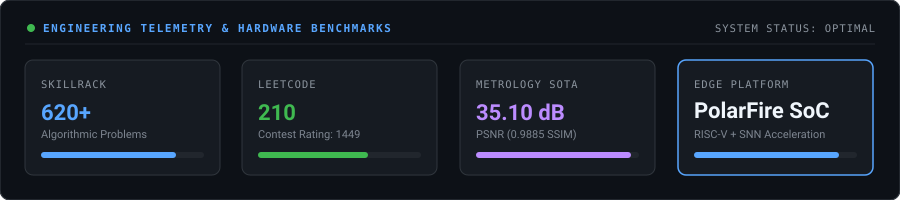
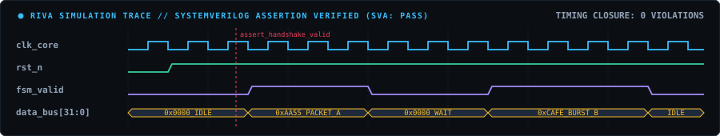

<!-- 🌌 COSMIC CIRCUIT & FLASHLIGHT GALAXY HEADER -->
<picture>
  <source media="(prefers-color-scheme: dark)" srcset="./header.svg">
  <source media="(prefers-color-scheme: light)" srcset="./header-light.svg">
  
</picture>

  

<!-- ⚡ HARDWARE TELEMETRY & SOTA BENCHMARKS -->

 

---

### 🔮 CORE SILICON DOMAINS

<table>
  <tr>
    <td width="25%" align="center" style="background-color:#0D1117;">
      <h4 style="color:#F59E0B; margin:6px 0;">⚡ VLSI &amp; FAB</h4>
      

        <b>22nm FinFET • 180nm CMOS</b> 
        6T SRAM Bitcell • PVT Corners 
        KLayout • SEMulator3D
      

    </td>
    <td width="25%" align="center" style="background-color:#0D1117;">
      <h4 style="color:#38BDF8; margin:6px 0;">💻 RTL DESIGN</h4>
      

        <b>SystemVerilog • Verilog • VHDL</b> 
        Pipelined Datapaths • FSM Control 
        STA &amp; Clock Domain Crossing
      

    </td>
    <td width="25%" align="center" style="background-color:#0D1117;">
      <h4 style="color:#34D399; margin:6px 0;">🔍 VERIFICATION</h4>
      

        <b>Synopsys VCS • Verdi</b> 
        Cadence Xcelium &amp; Spectre 
        SVA Assertions • Zero Violations
      

    </td>
    <td width="25%" align="center" style="background-color:#0D1117;">
      <h4 style="color:#A855F7; margin:6px 0;">🚀 FPGA &amp; EDGE AI</h4>
      

        <b>PolarFire SoC (RISC-V)</b> 
        Neuromorphic SNN Inference 
        AMD Xilinx Vivado Acceleration
      

    </td>
  </tr>
</table>

---

### 🛸 FEATURED HARDWARE PROJECTS

#### 🔹 [01] RIVA — RTL Intelligent Verification Assistant
> **SystemVerilog** • **VCS / Xcelium** • **SVA Assertions** • **Waveform Analyzer**
- Framework combining RTL linting, SVA assertions, and waveform anomaly detection for specification-driven verification closure.
- **Source:** [github.com/ilambharathim/AI_RTL_ASSISTANT](https://github.com/ilambharathim/AI_RTL_ASSISTANT)

<b>🔍 [CLICK TO EXPAND] TIMING SIMULATION WAVEFORM</b>

 

  

 

#### 🔹 [02] SNN-Based Object Detection — Microchip PolarFire SoC
> **Spiking Neural Networks** • **PolarFire SoC FPGA** • **RISC-V Coprocessor** • **Edge AI**
- Event-driven neuromorphic inference pipeline on the PolarFire SoC FPGA, maximizing energy efficiency via spike sparsity.

 

#### 🔹 [03] 22 nm 6T FinFET SRAM Cell — Area Scaling &amp; Layout
> **22nm FinFET** • **6T SRAM** • **KLayout** • **SEMulator3D** • **Synopsys Custom Compiler**
- Designed 6T SRAM bitcell with 30nm fin pitch; evaluated read/write Static Noise Margins (SNM) and 3D process emulation profiles.

 

#### 🔹 [04] 180 nm CMOS Capacitance-to-Digital Converter
> **Cadence Virtuoso** • **Spectre** • **180nm CMOS** • **Analog Layout** • **PVT Analysis**
- Transistor-level switched-capacitor CDC with full corner characterization across $-40^\circ	ext{C}$ to ^\circ	ext{C}$.

 

#### 🔹 [05] 4.8 GHz PLL Analog &amp; Mixed-Signal Verification
> **Cadence Virtuoso** • **Spectre** • **PFD / CP / VCO / Loop Filter** • **Phase Noise**
- Validated lock range (4.4 – 5.2 GHz), jitter settling ($< 1.8\ \mu	ext{s}$), and phase noise ($-112	ext{ dBc/Hz}$ @ 1 MHz).

 

#### 🔹 [06] Gesture-to-Speech FPGA System
> **Verilog HDL** • **Xilinx Vivado** • **FSM Architecture** • **Real-Time DSP**
- Real-time gesture classification engine synthesizing multi-finger sensor dynamics into audio indices with deterministic $< 15	ext{ ms}$ latency.

 

#### 🔹 [07] [SEMICON India 2026] Semiconductor Image Restoration
> **PyTorch 2.0** • **NAFNet** • **SEM Metrology** • **35.10 dB PSNR** • **KLA Track PS01**
- SOTA deep learning restoration pipeline for noisy Scanning Electron Microscope (SEM) wafer images with **35.10 dB PSNR**, **0.9885 SSIM**, and **sub-2.4ms latency**.
- **Source:** [github.com/ilambharathim/TEAM-KIRAH_KLA_PSO1](https://github.com/ilambharathim/TEAM-KIRAH_KLA_PSO1)

---

### 🧰 TECHNICAL TOOLCHAIN

---

### 💼 EXPERIENCE &amp; RESEARCH

`
May 2026 – Jun 2026   Research Intern // IIITDM Kancheepuram
                      • Hardware-efficient AI accelerator architectures & edge quantization.

Oct 2025 – Nov 2025   Project Intern // Synopsys Centre of Excellence (CIT)
                      • 180 nm CMOS Capacitance-to-Digital Converter in Cadence Virtuoso & Spectre.

May 2025 – Jun 2025   Embedded Systems Intern // Phoenix Soft Tech
                      • Microcontroller bus interfacing (SPI/I2C/UART) & peripheral firmware.
`

---

### 📐 SILICON IMPLEMENTATION FLOW

<picture>
  <source media="(prefers-color-scheme: dark)" srcset="./pipeline.svg">
  <source media="(prefers-color-scheme: light)" srcset="./pipeline-light.svg">
  
</picture>

---

### 🎓 EDUCATION &amp; HONORS

- **Chennai Institute of Technology** — *Bachelor of Electronics and Communication Engineering (2024 – 2028)*
- **DVCon India 2026** — Contributing to AI-assisted hardware verification & design analysis.
- **Central India Hackathon** — *Top 7 Finalist* (100+ national teams, automated air-quality response).
- **SEMICON India Hackathon 2026** — *Team Leader (Team KIRAH)*, SOTA SEM image restoration.

---

### 📬 GET IN TOUCH

