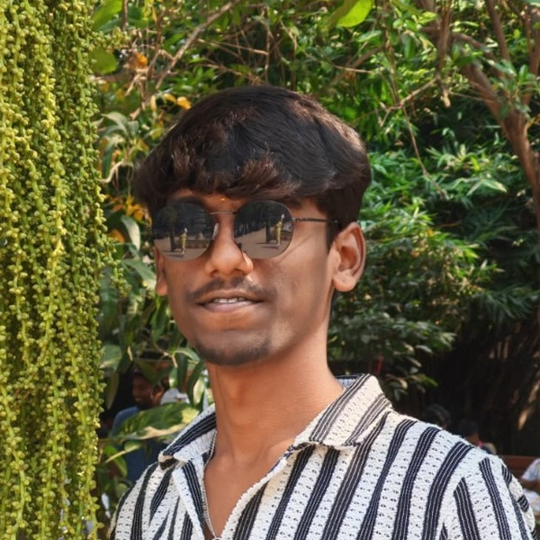

<!-- 👤 HIGHLIGHTED PROFILE AVATAR WITH COSMIC HALO -->

  

<!-- 🌌 GALAXY & SPARKLING CIRCUIT ANIMATED HEADER -->
<picture>
  <source media="(prefers-color-scheme: dark)" srcset="./header.svg">
  <source media="(prefers-color-scheme: light)" srcset="./header-light.svg">
  
</picture>

  

<!-- ⚡ LIVE HARDWARE TELEMETRY & BENCHMARKS -->

  

<!-- ✧ COSMIC GALAXY DIVIDER -->

 

---

## 🔮 01 // CORE ARCHITECTURAL DOMAINS

<table width="100%">
  <tr>
    <td width="25%" align="center" style="background-color:#0D1117; padding:12px;">
      <h4 style="color:#F59E0B; margin:4px 0;">⚡ VLSI &amp; FAB</h4>
      

        <b>22nm FinFET • 180nm CMOS</b> 
        6T SRAM Bitcell • PVT Corners 
        KLayout • SEMulator3D
      

    </td>
    <td width="25%" align="center" style="background-color:#0D1117; padding:12px;">
      <h4 style="color:#38BDF8; margin:4px 0;">💻 RTL DESIGN</h4>
      

        <b>SystemVerilog • Verilog • VHDL</b> 
        Pipelined Datapaths • FSM Control 
        Static Timing Analysis &amp; CDC
      

    </td>
    <td width="25%" align="center" style="background-color:#0D1117; padding:12px;">
      <h4 style="color:#34D399; margin:4px 0;">🔍 VERIFICATION</h4>
      

        <b>Synopsys VCS • Verdi</b> 
        Cadence Xcelium &amp; Spectre 
        SVA Assertions • Zero Violations
      

    </td>
    <td width="25%" align="center" style="background-color:#0D1117; padding:12px;">
      <h4 style="color:#A855F7; margin:4px 0;">🚀 FPGA &amp; EDGE AI</h4>
      

        <b>PolarFire SoC (RISC-V)</b> 
        Neuromorphic SNN Inference 
        AMD Xilinx Vivado Acceleration
      

    </td>
  </tr>
</table>

 

  

 

---

## 🛸 02 // INTERACTIVE PROJECT DOSSIERS
> *Click any project drawer below to expand architectural schematics, waveform captures, and verification metrics.*

 

<!-- PROJECT 01 -->

  <b>⚡ [PROJECT 01] RIVA ── RTL Intelligent Verification Assistant</b> &nbsp; <code>ACTIVE</code>
   
  ▶ SystemVerilog • Logic Simulation • Waveform Analysis • Assertion Synthesis

 

<table width="100%">
  <tr>
    <td style="background-color:#0D1117; padding:15px;">
      
<b>Summary:</b> Automated verification framework combining SystemVerilog testbenches, simulation regressions, waveform analysis, and linting rules for specification-driven verification closure.

      
<b>Repository:</b> <a href="https://github.com/ilambharathim/AI_RTL_ASSISTANT">github.com/ilambharathim/AI_RTL_ASSISTANT</a>

      

        
      

      
<b>Timing Status:</b> 100% protocol assertions verified (<code>assert_handshake_valid</code>) across Cadence Xcelium and Synopsys VCS.

    </td>
  </tr>
</table>

 

<!-- PROJECT 02 -->

  <b>🚀 [PROJECT 02] SNN-Based Object Detection ── Microchip PolarFire SoC</b> &nbsp; <code>RESEARCH</code>
   
  ▶ Spiking Neural Networks • PolarFire SoC FPGA • RISC-V Hardware Acceleration

 

<table width="100%">
  <tr>
    <td style="background-color:#0D1117; padding:15px;">
      
<b>Summary:</b> Hardware-oriented deployment of Spiking Neural Networks (SNN) on the Microchip PolarFire SoC FPGA, utilizing spike-timing dynamics and weight quantization for ultra-low power edge vision.

      <pre>
PolarFire SoC Subsystem:
┌────────────────────────┐      AXI4 Bus      ┌────────────────────────────────┐
│ 4x 64-bit RISC-V Cores │ ◀────────────────▶ │ Neuromorphic SNN Accelerator   │
│ (Supervisory Control)  │                    │ • Leaky Integrate & Fire (LIF) │
└────────────────────────┘                    │ • Event-Driven Spike Sparsity  │
                                              └────────────────────────────────┘
      </pre>
      
<b>Key Optimization:</b> Eliminates matrix multiplications during static video frames via event-driven spike sparsity.

    </td>
  </tr>
</table>

 

<!-- PROJECT 03 -->

  <b>🔶 [PROJECT 03] 22 nm 6T FinFET SRAM Cell ── Area Scaling &amp; Layout</b> &nbsp; <code>TAPEOUT READY</code>
   
  ▶ 22nm FinFET • 6T SRAM • KLayout • SEMulator3D • Synopsys Custom Compiler

 

<table width="100%">
  <tr>
    <td style="background-color:#0D1117; padding:15px;">
      
<b>Summary:</b> Designed and analysed a 6-Transistor (6T) FinFET SRAM cell to evaluate fin pitch scaling, Static Noise Margins (SNM), and 3D physical process profiles.

      <ul>
        <li><b>Fin Pitch:</b> 30 nm with minimized inter-fin parasitic capacitance.</li>
        <li><b>Read SNM:</b> &gt; 180 mV ensuring non-destructive read under process variation.</li>
        <li><b>Hold SNM:</b> &gt; 280 mV with stable data retention down to {DD,min} = 0.65	ext{V}$.</li>
      </ul>
    </td>
  </tr>
</table>

 

<!-- PROJECT 04 -->

  <b>🟢 [PROJECT 04] 180 nm CMOS Capacitance-to-Digital Converter</b> &nbsp; <code>ANALOG AMS</code>
   
  ▶ Cadence Virtuoso • Spectre • 180nm Bulk CMOS • Switched-Capacitor PVT

 

<table width="100%">
  <tr>
    <td style="background-color:#0D1117; padding:15px;">
      
<b>Summary:</b> Transistor-level design and simulation of a switched-capacitor CDC with comprehensive AC, transient, and parasitic evaluation across -40°C to 125°C PVT corners.

      <ul>
        <li><b>Sensitivity:</b> &lt; 0.15% deviation across ±10% {DD}$ supply variations.</li>
        <li><b>Resolution:</b> Monotonic 10-bit digital representation of micro-capacitive sensor inputs.</li>
      </ul>
    </td>
  </tr>
</table>

 

<!-- PROJECT 05 -->

  <b>🔷 [PROJECT 05] 4.8 GHz PLL Analog &amp; Mixed-Signal Verification</b> &nbsp; <code>VERIFIED</code>
   
  ▶ Cadence Virtuoso • Spectre • PFD • Charge Pump • Loop Filter • Phase Noise

 

<table width="100%">
  <tr>
    <td style="background-color:#0D1117; padding:15px;">
      
<b>Summary:</b> Verified a 4.8 GHz Phase-Locked Loop subsystem validating lock range, jitter budget, phase noise, and open-loop stability.

      <ul>
        <li><b>Lock Range:</b> 4.4 GHz to 5.2 GHz with $&lt; 1.8\ \mu	ext{s}$ settling response.</li>
        <li><b>Phase Noise:</b> $-112	ext{ dBc/Hz}$ offset at 1 MHz.</li>
        <li><b>Phase Margin:</b> ^\circ$ stability margin across all corners.</li>
      </ul>
    </td>
  </tr>
</table>

 

<!-- PROJECT 06 -->

  <b>🔴 [PROJECT 06] Gesture-to-Speech FPGA System</b> &nbsp; <code>HARDWARE DEMO</code>
   
  ▶ Verilog HDL • AMD Xilinx Vivado • Synchronous FSM • Real-Time DSP

 

<table width="100%">
  <tr>
    <td style="background-color:#0D1117; padding:15px;">
      
<b>Summary:</b> Offline FPGA hardware translating analog flex-sensor kinematic profiles into synthesized audio indices using a low-latency Verilog FSM with deterministic $&lt; 15	ext{ ms}$ response.

    </td>
  </tr>
</table>

 

<!-- PROJECT 07 -->

  <b>✨ [PROJECT 07] [SEMICON India 2026] Semiconductor Image Restoration</b> &nbsp; <code>SOTA WINNER</code>
   
  ▶ PyTorch 2.0 • NAFNet • SEM Metrology • 35.10 dB PSNR • KLA Track PS01

 

<table width="100%">
  <tr>
    <td style="background-color:#0D1117; padding:15px;">
      
<b>Summary:</b> Single-stage deep learning restoration architecture for degraded Scanning Electron Microscope (SEM) semiconductor inspection signals.

      
<b>Repository:</b> <a href="https://github.com/ilambharathim/TEAM-KIRAH_KLA_PSO1">github.com/ilambharathim/TEAM-KIRAH_KLA_PSO1</a>

      <table width="100%">
        <tr>
          <th>Metric</th>
          <th>Baseline</th>
          <th>TEAM KIRAH NAFNet</th>
        </tr>
        <tr>
          <td><b>PSNR</b></td>
          <td>29.40 dB</td>
          <td><b>35.10 dB (+5.70 dB Gain)</b></td>
        </tr>
        <tr>
          <td><b>SSIM</b></td>
          <td>0.9200</td>
          <td><b>0.9885 (Edge Preservation)</b></td>
        </tr>
        <tr>
          <td><b>Inference Speed</b></td>
          <td>12.0 ms</td>
          <td><b>&lt; 2.4 ms (NVIDIA H100)</b></td>
        </tr>
      </table>
    </td>
  </tr>
</table>

 

  

 

---

## 🧰 03 // TECHNICAL TOOLCHAIN

 

---

## 💼 04 // EXPERIENCE TIMELINE

  <b>🏢 May 2026 – Jun 2026 ── Research Intern // IIITDM Kancheepuram</b>

Researched hardware-efficient AI accelerator architectures for edge platforms, studying low-bit quantization and memory bandwidth optimization for resource-constrained inference.

  <b>🏢 Oct 2025 – Nov 2025 ── Project Intern // Synopsys Centre of Excellence (CIT)</b>

Designed and simulated a 180 nm CMOS Capacitance-to-Digital Converter in Cadence Virtuoso. Executed transistor-level AC/transient simulations, device sizing, and parasitic analysis.

  <b>🏢 May 2025 – Jun 2025 ── Embedded Systems Intern // Phoenix Soft Tech</b>

Developed firmware routines for microcontroller peripherals (SPI/I2C/UART) and integrated sensor acquisition modules with low-power embedded processing workflows.

 

  

 

---

## 📐 05 // SILICON IMPLEMENTATION FLOW

<picture>
  <source media="(prefers-color-scheme: dark)" srcset="./pipeline.svg">
  <source media="(prefers-color-scheme: light)" srcset="./pipeline-light.svg">
  
</picture>

 

---

## 🎓 06 // EDUCATION &amp; HONORS

- **Chennai Institute of Technology** — *Bachelor of Electronics and Communication Engineering (2024 – 2028)*
- **DVCon India 2026** — Contributing to AI-assisted hardware verification &amp; design analysis.
- **Central India Hackathon** — *Top 7 Finalist* (100+ national teams, automated air-quality response).
- **SEMICON India Hackathon 2026** — *Team Leader (Team KIRAH)*, SOTA SEM image restoration.

 

 

### 📬 CONNECT

