<!-- 🌌 DEEP SPACE GALAXY & SPARKLING CIRCUIT HEADER -->
<picture>
  <source media="(prefers-color-scheme: dark)" srcset="./header.svg">
  <source media="(prefers-color-scheme: light)" srcset="./header-light.svg">
  
</picture>

  

<!-- ⚡ FLOATING TELEMETRY CONSOLE -->

  

<!-- ✧ COSMIC GALAXY STARDUST DIVIDER -->

  

<!-- 🔮 4 CURVY FLOATING DOMAIN CAPSULES -->

  

---

  <h2>✨ Projects</h2>
  
<i>Touch or click any floating card below to expand the architectural schematics, waveforms &amp; performance metrics.</i>

 

<!-- ⚡ PROJECT CARD: RIVA -->

  

<table width="100%" style="background: #050811; border: 1.5px solid #38BDF8; border-radius: 18px; padding: 18px; margin-top: 10px;">
  <tr>
    <td>
      <h3 style="color: #38BDF8; margin-top: 0;">RIVA — RTL Intelligent Verification Assistant</h3>
      
<b>Overview:</b> Automated verification framework combining SystemVerilog testbenches, simulation regressions, waveform analysis, and linting rules for specification-driven verification closure.

      
<b>Repository:</b> <a href="https://github.com/ilambharathim/AI_RTL_ASSISTANT">github.com/ilambharathim/AI_RTL_ASSISTANT</a>

      

        
      

      
<b>Verification Status:</b> 100% protocol assertions passing (<code>assert_handshake_valid</code>) across Cadence Xcelium and Synopsys VCS.

    </td>
  </tr>
</table>

 

<!-- 🚀 PROJECT CARD: SNN -->

  

<table width="100%" style="background: #050811; border: 1.5px solid #A855F7; border-radius: 18px; padding: 18px; margin-top: 10px;">
  <tr>
    <td>
      <h3 style="color: #A855F7; margin-top: 0;">SNN-Based Object Detection — Microchip PolarFire SoC</h3>
      
<b>Overview:</b> Hardware-oriented deployment of Spiking Neural Networks (SNN) on the PolarFire SoC FPGA platform, optimizing spike-timing dynamics and weight quantization for resource-constrained edge vision.

      <pre>
  PolarFire SoC FPGA Subsystem:
  ┌────────────────────────┐      AXI4 Bus      ┌────────────────────────────────┐
  │ 4x 64-bit RISC-V Cores │ ◀────────────────▶ │ Neuromorphic SNN Accelerator   │
  │ (Supervisory Control)  │                    │ • Leaky Integrate & Fire (LIF) │
  └────────────────────────┘                    │ • Event-Driven Spike Sparsity  │
                                                └────────────────────────────────┘
      </pre>
      
<b>Energy Optimization:</b> Eliminates redundant multiply-accumulate operations during static frames via event-driven spike sparsity.

    </td>
  </tr>
</table>

 

<!-- 🔶 PROJECT CARD: SRAM -->

  

<table width="100%" style="background: #050811; border: 1.5px solid #F59E0B; border-radius: 18px; padding: 18px; margin-top: 10px;">
  <tr>
    <td>
      <h3 style="color: #F59E0B; margin-top: 0;">22 nm 6T FinFET SRAM Cell — Area Scaling &amp; Layout</h3>
      
<b>Overview:</b> Designed and analysed a 6-Transistor (6T) FinFET SRAM memory cell to study fin pitch scaling, Static Noise Margins (SNM), and 3D physical process profiles.

      <ul style="color: #94A3B8;">
        <li><b>Fin Pitch:</b> 30 nm with minimized parasitic capacitance between adjacent channel fins.</li>
        <li><b>Read SNM:</b> &gt; 180 mV ensuring non-destructive read operations under process variation.</li>
        <li><b>Hold SNM:</b> &gt; 280 mV with stable data retention down to {DD,min} = 0.65	ext{V}$.</li>
      </ul>
    </td>
  </tr>
</table>

 

<!-- 🟢 PROJECT CARD: CDC -->

  

<table width="100%" style="background: #050811; border: 1.5px solid #34D399; border-radius: 18px; padding: 18px; margin-top: 10px;">
  <tr>
    <td>
      <h3 style="color: #34D399; margin-top: 0;">180 nm CMOS Capacitance-to-Digital Converter</h3>
      
<b>Overview:</b> Transistor-level design and simulation of a switched-capacitor CDC with comprehensive AC, transient, and parasitic evaluation across -40°C to 125°C PVT corners.

      <ul style="color: #94A3B8;">
        <li><b>Sensitivity:</b> &lt; 0.15% deviation across ±10% {DD}$ supply variations.</li>
        <li><b>Resolution:</b> Monotonic 10-bit digital representation of micro-capacitive inputs.</li>
      </ul>
    </td>
  </tr>
</table>

 

<!-- 🔷 PROJECT CARD: PLL -->

  

<table width="100%" style="background: #050811; border: 1.5px solid #38BDF8; border-radius: 18px; padding: 18px; margin-top: 10px;">
  <tr>
    <td>
      <h3 style="color: #38BDF8; margin-top: 0;">4.8 GHz PLL Analog &amp; Mixed-Signal Verification</h3>
      
<b>Overview:</b> Verified a 4.8 GHz Phase-Locked Loop subsystem validating lock range, settling behavior, jitter performance, and open-loop stability.

      <ul style="color: #94A3B8;">
        <li><b>Lock Range:</b> 4.4 GHz to 5.2 GHz with fast settling response (&lt; 1.8 µs).</li>
        <li><b>Phase Noise:</b> -112 dBc/Hz offset at 1 MHz.</li>
        <li><b>Phase Margin:</b> 58° open-loop stability margin across all corners.</li>
      </ul>
    </td>
  </tr>
</table>

 

<!-- 🔴 PROJECT CARD: GESTURE -->

  

<table width="100%" style="background: #050811; border: 1.5px solid #EC4899; border-radius: 18px; padding: 18px; margin-top: 10px;">
  <tr>
    <td>
      <h3 style="color: #EC4899; margin-top: 0;">Gesture-to-Speech FPGA System</h3>
      
<b>Overview:</b> Offline FPGA hardware translating analog flex-sensor kinematic profiles into synthesized audio indices using a low-latency Verilog FSM with deterministic &lt; 15 ms response.

    </td>
  </tr>
</table>

 

<!-- ✨ PROJECT CARD: SEMICON -->

  

<table width="100%" style="background: #050811; border: 1.5px solid #10B981; border-radius: 18px; padding: 18px; margin-top: 10px;">
  <tr>
    <td>
      <h3 style="color: #10B981; margin-top: 0;">Semiconductor Image Restoration — SEMICON India 2026</h3>
      
<b>Overview:</b> Single-stage deep learning restoration architecture for degraded Scanning Electron Microscope (SEM) semiconductor inspection signals.

      
<b>Repository:</b> <a href="https://github.com/ilambharathim/TEAM-KIRAH_KLA_PSO1">github.com/ilambharathim/TEAM-KIRAH_KLA_PSO1</a>

      <table width="100%">
        <tr>
          <th>Metric</th>
          <th>Baseline</th>
          <th>TEAM KIRAH NAFNet</th>
        </tr>
        <tr>
          <td><b>PSNR</b></td>
          <td>29.40 dB</td>
          <td><b>35.10 dB (+5.70 dB Gain)</b></td>
        </tr>
        <tr>
          <td><b>SSIM</b></td>
          <td>0.9200</td>
          <td><b>0.9885 (Edge Preservation)</b></td>
        </tr>
        <tr>
          <td><b>Inference Speed</b></td>
          <td>12.0 ms</td>
          <td><b>&lt; 2.4 ms (NVIDIA H100)</b></td>
        </tr>
      </table>
    </td>
  </tr>
</table>

 

  

 

---

## 🧰 Technical Toolchain

 

---

## 💼 Experience &amp; Research

  🏢 May 2026 – Jun 2026 ── Research Intern // IIITDM Kancheepuram

Researched hardware-efficient AI accelerator architectures for edge platforms, studying low-bit quantization and memory bandwidth optimization for resource-constrained inference.

  🏢 Oct 2025 – Nov 2025 ── Project Intern // Synopsys Centre of Excellence (CIT)

Designed and simulated a 180 nm CMOS Capacitance-to-Digital Converter in Cadence Virtuoso. Executed transistor-level AC/transient simulations, device sizing, and parasitic analysis.

  🏢 May 2025 – Jun 2025 ── Embedded Systems Intern // Phoenix Soft Tech

Developed firmware routines for microcontroller peripherals (SPI/I2C/UART) and integrated sensor acquisition modules with low-power embedded processing workflows.

 

  

 

---

## 📐 Silicon Implementation Flow

<picture>
  <source media="(prefers-color-scheme: dark)" srcset="./pipeline.svg">
  <source media="(prefers-color-scheme: light)" srcset="./pipeline-light.svg">
  
</picture>

 

---

## 🎓 Education &amp; Honors

- **Chennai Institute of Technology** — *Bachelor of Electronics and Communication Engineering (2024 – 2028)*
- **DVCon India 2026** — Contributing to AI-assisted hardware verification &amp; design analysis.
- **Central India Hackathon** — *Top 7 Finalist* (100+ national teams, automated air-quality response).
- **SEMICON India Hackathon 2026** — *Team Leader (Team KIRAH)*, SOTA SEM image restoration.

 

 

### 📬 Connect

