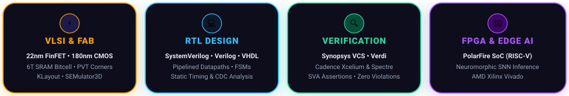

<!-- 🌌 DEEP SPACE GALAXY & SPARKLING CIRCUIT HEADER -->
<picture>
  <source media="(prefers-color-scheme: dark)" srcset="./header.svg">
  <source media="(prefers-color-scheme: light)" srcset="./header-light.svg">
  
</picture>

  

<!-- ⚡ FLOATING TELEMETRY CONSOLE -->

  

<!-- ✧ COSMIC GALAXY STARDUST DIVIDER -->

  

<!-- 🔮 4 CURVY FLOATING DOMAIN CAPSULES -->

  

---

## ✨ Featured Projects

 

### ⚡ RIVA — RTL Intelligent Verification Assistant
> SystemVerilog • Logic Simulation • Waveform Analysis • SVA Assertions • ● ACTIVE

- Developing an automated verification framework combining SystemVerilog testbenches, simulation regressions, waveform analysis, and linting rules for specification-driven verification closure.
- Traces functional discrepancies from testbench assertions directly to failing RTL datapath signals.
- **Repository:** [github.com/ilambharathim/AI_RTL_ASSISTANT](https://github.com/ilambharathim/AI_RTL_ASSISTANT)

  

 

---

### 🚀 SNN-Based Object Detection — Microchip PolarFire SoC
> Spiking Neural Networks • PolarFire SoC FPGA • RISC-V Coprocessor • Edge AI Acceleration

- Exploring hardware-oriented deployment of Spiking Neural Networks (SNN) on the PolarFire SoC FPGA platform, optimizing spike-timing dynamics and weight quantization for resource-constrained edge vision.
- Exploits PolarFire non-volatile flash architecture for near-zero static leakage power while eliminating redundant multiply-accumulate operations during static frames via event-driven spike sparsity.

`
  PolarFire SoC FPGA Hardware Subsystem:
  ┌────────────────────────┐      AXI4 Bus      ┌────────────────────────────────┐
  │ 4x 64-bit RISC-V Cores │ ◀────────────────▶ │ Neuromorphic SNN Accelerator   │
  │ (Supervisory Control)  │                    │ • Leaky Integrate & Fire (LIF) │
  └────────────────────────┘                    │ • Event-Driven Spike Sparsity  │
                                                └────────────────────────────────┘
`

 

---

### 🔶 22 nm 6T FinFET SRAM Cell — Area Scaling &amp; Layout
> 22nm FinFET • 6T SRAM • KLayout • SEMulator3D • Synopsys Custom Compiler

- Designed and analysed a 6-Transistor (6T) FinFET SRAM memory cell to study fin pitch scaling, Static Noise Margins (SNM), and 3D physical process profiles.
- **Fin Pitch:** 30 nm with minimized parasitic capacitance between adjacent channel fins.
- **Read SNM:** &gt; 180 mV ensuring non-destructive read operations under process variation.
- **Hold SNM:** &gt; 280 mV with stable data retention down to {DD,min} = 0.65	ext{V}$.

 

---

### 🟢 180 nm CMOS Capacitance-to-Digital Converter
> Cadence Virtuoso • Spectre • 180nm Bulk CMOS • Switched-Capacitor PVT

- Transistor-level design and simulation of an analog switched-capacitor CDC with comprehensive AC, transient, and parasitic evaluation across -40°C to 125°C PVT corners.
- **Sensitivity:** &lt; 0.15% deviation across ±10% {DD}$ supply variations.
- **Resolution:** Monotonic 10-bit digital representation of micro-capacitive sensor inputs.

 

---

### 🔷 4.8 GHz PLL Analog &amp; Mixed-Signal Verification
> Cadence Virtuoso • Spectre • PFD / Charge Pump / VCO • Phase Noise • VERIFIED

- Verified a 4.8 GHz Phase-Locked Loop subsystem validating lock range, settling behavior, jitter performance, and open-loop stability.
- **Lock Range:** 4.4 GHz to 5.2 GHz with fast settling response (&lt; 1.8 µs).
- **Phase Noise:** -112 dBc/Hz offset at 1 MHz with 58° open-loop phase margin across all corners.

 

---

### 🔴 Gesture-to-Speech FPGA System
> Verilog HDL • AMD Xilinx Vivado • Synchronous FSM • Real-Time DSP

- Offline FPGA hardware translating analog flex-sensor kinematic profiles into synthesized audio indices using a low-latency Verilog FSM with deterministic &lt; 15 ms response.

 

---

### ✨ Semiconductor Image Restoration — SEMICON India 2026
> PyTorch 2.0 • NAFNet • SEM Metrology • 35.10 dB PSNR • KLA Track PS01

- Single-stage deep learning restoration architecture for degraded Scanning Electron Microscope (SEM) semiconductor inspection signals.
- **Repository:** [github.com/ilambharathim/TEAM-KIRAH_KLA_PSO1](https://github.com/ilambharathim/TEAM-KIRAH_KLA_PSO1)

| Metric | Target Baseline | TEAM KIRAH NAFNet | Gain |
| :--- | :--- | :--- | :--- |
| **Peak SNR (PSNR)** | 29.40 dB | **35.10 dB** | **+5.70 dB Gain** |
| **Structural Similarity (SSIM)** | 0.9200 | **0.9885** | High Edge Fidelity |
| **Inference Latency (H100)** | 12.0 ms | **&lt; 2.4 ms** | Real-Time Metrology Speed |

 

  

---

## 🧰 Technical Toolchain

 

---

## 💼 Experience &amp; Research

`
May 2026 – Jun 2026   Research Intern // IIITDM Kancheepuram
                      • Hardware-efficient AI accelerator architectures & edge quantization.

Oct 2025 – Nov 2025   Project Intern // Synopsys Centre of Excellence (CIT)
                      • 180 nm CMOS Capacitance-to-Digital Converter in Cadence Virtuoso & Spectre.

May 2025 – Jun 2025   Embedded Systems Intern // Phoenix Soft Tech
                      • Microcontroller bus interfacing (SPI/I2C/UART) & peripheral firmware.
`

 

  

---

## 📐 Silicon Implementation Flow

<picture>
  <source media="(prefers-color-scheme: dark)" srcset="./pipeline.svg">
  <source media="(prefers-color-scheme: light)" srcset="./pipeline-light.svg">
  
</picture>

 

---

## 🎓 Education &amp; Honors

- **Chennai Institute of Technology** — *Bachelor of Electronics and Communication Engineering (2024 – 2028)*
- **DVCon India 2026** — Contributing to AI-assisted hardware verification &amp; design analysis.
- **Central India Hackathon** — *Top 7 Finalist* (100+ national teams, automated air-quality response).
- **SEMICON India Hackathon 2026** — *Team Leader (Team KIRAH)*, SOTA SEM image restoration.

 

 

### 📬 Connect

