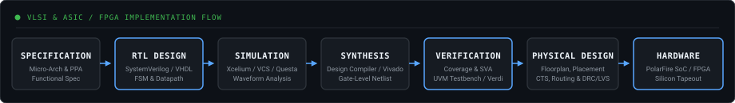

<!-- ================================================================= -->
<!-- ILAM BHARATHI — HARDWARE & VLSI PORTFOLIO README                  -->
<!-- Target Domains: VLSI / RTL Design / Verification / FPGA / Edge AI  -->
<!-- ================================================================= -->

<div align="center">

<picture>
  <source media="(prefers-color-scheme: dark)" srcset="./header.svg">
  <source media="(prefers-color-scheme: light)" srcset="./header-light.svg">
  
</picture>

</div>

<br>

```bash
$ whoami
ilambharathim

$ domain
VLSI / RTL Design / Digital Verification / FPGA / Hardware AI

$ hdl_stack
Verilog-2001 / SystemVerilog (IEEE 1800) / VHDL

$ eda_tooling
Cadence (Virtuoso, Spectre, Xcelium) / Synopsys (Custom Compiler, VCS, Verdi) / KLayout / Vivado

$ current_focus
Hardware-efficient intelligent edge architectures & specification-driven RTL verification
```

---

### 🔬 Engineering Background

Electronics and Communication Engineering undergraduate with a focused interest in VLSI, RTL design, digital verification, FPGA systems, and hardware-efficient AI. My work spans transistor-level circuit design, semiconductor layout, SystemVerilog-based RTL development, verification, and hardware acceleration for resource-constrained edge systems.

```
VLSI ──▶ RTL DESIGN ──▶ DIGITAL VERIFICATION ──▶ FPGA ──▶ HARDWARE ACCELERATION ──▶ EDGE AI
```

---

### ⚙️ Engineering Focus

<table>
  <tr>
    <td width="50%" valign="top">
      <h4>⚡ VLSI &amp; Semiconductor Design</h4>
      <ul>
        <li><b>Technologies:</b> CMOS, FinFET, SRAM, Analog Circuits, Physical Layout</li>
        <li><b>Analysis:</b> Device-level parasitic evaluation, area scaling, PVT corner simulation</li>
        <li><b>Methodology:</b> Schematic capture, DRC/LVS clean tapeout-ready layout rules</li>
      </ul>
    </td>
    <td width="50%" valign="top">
      <h4>💻 RTL &amp; Digital Design</h4>
      <ul>
        <li><b>Languages:</b> Verilog, SystemVerilog, VHDL</li>
        <li><b>Architecture:</b> Pipelined datapaths, synchronous FSMs, memory controllers</li>
        <li><b>Synthesis &amp; Timing:</b> Static timing analysis (STA), clock-domain crossing (CDC)</li>
      </ul>
    </td>
  </tr>
  <tr>
    <td width="50%" valign="top">
      <h4>🔍 Verification &amp; EDA Tooling</h4>
      <ul>
        <li><b>Simulators:</b> Cadence Xcelium, Synopsys VCS, Mentor QuestaSim</li>
        <li><b>Debug &amp; Waveforms:</b> Synopsys Verdi, GTKWave, assertion-based verification (SVA)</li>
        <li><b>Analog / Mixed-Signal:</b> Cadence Virtuoso, Spectre, Synopsys Custom Compiler</li>
      </ul>
    </td>
    <td width="50%" valign="top">
      <h4>🚀 FPGA &amp; Hardware AI</h4>
      <ul>
        <li><b>Platforms:</b> Microchip PolarFire SoC FPGA (RISC-V), AMD Xilinx Vivado</li>
        <li><b>Edge Architectures:</b> Spiking Neural Networks (SNN), quantised matrix accelerators</li>
        <li><b>Embedded Targets:</b> Real-time signal acquisition, hardware/software co-design</li>
      </ul>
    </td>
  </tr>
</table>

---

### 📍 Current Work

- `● ACTIVE` **[RIVA — RTL Intelligent Verification Assistant](https://github.com/ilambharathim/AI_RTL_ASSISTANT)**  
  SystemVerilog-based framework for RTL validation, simulation, waveform analysis, linting, and automated debugging workflows. Designed to accelerate specification-driven verification closure.
  
- `● ACTIVE` **SNN-Based Object Detection (PolarFire SoC)**  
  Exploring hardware-oriented deployment of Spiking Neural Networks (SNN) on the Microchip PolarFire SoC FPGA platform, optimising spike-timing dynamics and weight quantization for resource-constrained edge inference.

---

### 🛠️ Featured Technical Projects

#### 01. [RIVA — RTL Intelligent Verification Assistant](https://github.com/ilambharathim/AI_RTL_ASSISTANT)
> `SystemVerilog` `RTL` `Simulation` `Waveform Analysis` `Linting` `Verification`
- Developing an automated verification framework combining SystemVerilog testbenches, simulation regressions, waveform analysis, and linting rules.
- Integrates specification-driven debugging techniques to trace functional discrepancies from testbench assertions down to failing RTL datapath signals.

#### 02. SNN-Based Object Detection — PolarFire SoC
> `SNN` `FPGA` `Microchip PolarFire SoC` `Edge AI` `Hardware Acceleration`
- Hardware-oriented deployment of Spiking Neural Networks on the PolarFire SoC FPGA platform.
- Evaluates event-driven neural computation, low-power neuromorphic architectures, and systolic-array acceleration under strict thermal and memory budgets.

#### 03. 22 nm 6T FinFET SRAM Cell — Area Scaling & Layout Analysis
> `FinFET` `SRAM` `KLayout` `SEMulator3D` `Synopsys Custom Compiler`
- Designed and analysed a 6-Transistor (6T) FinFET SRAM memory cell targeting the 22 nm node.
- Evaluated 3D process emulation profiles using SEMulator3D, transistor fin pitch sizing, read/write static noise margins (SNM), and silicon area scaling in KLayout.

#### 04. 180 nm CMOS Capacitance-to-Digital Converter (CDC)
> `Cadence Virtuoso` `Spectre` `180 nm CMOS` `Analog Design` `PVT Analysis`
- Designed and simulated an analog Capacitance-to-Digital Converter at the transistor level using Cadence Virtuoso and Spectre.
- Investigated device aspect ratios, switch charge injection, parasitic extraction, and sensitivity across process, voltage, and temperature (PVT) variations.

#### 05. 4.8 GHz PLL Analog & Mixed-Signal Verification
> `Cadence Virtuoso` `Spectre` `PLL` `Phase Noise` `Analog Verification`
- Verified a 4.8 GHz Phase-Locked Loop (PLL) sub-system consisting of a Phase Frequency Detector (PFD), charge pump, passive loop filter, Voltage-Controlled Oscillator (VCO), and frequency divider.
- Validated lock range, settling behaviour, jitter performance, phase noise, and open-loop stability criteria.

#### 06. Gesture-to-Speech FPGA System
> `Verilog HDL` `Xilinx FPGA` `FSM Architecture` `Sensor Interfacing` `Real-Time Signal Processing`
- Developed an FPGA-based real-time gesture interpretation system utilising analog flex sensors and ADC signal translation.
- Synthesized a low-latency Mealy/Moore finite state machine in Verilog to translate multi-finger kinematic profiles directly into audio output indices.

#### 07. [AI-Based Restoration of Degraded Semiconductor Images — SEMICON India 2026](https://github.com/ilambharathim/TEAM-KIRAH_KLA_PSO1)
> `Python` `PyTorch` `NAFNet` `Semiconductor Metrology` `SEM Denoising` `KLA Track`
- Developed an end-to-end deep learning restoration architecture for degraded Scanning Electron Microscope (SEM) semiconductor wafer inspection signals.
- Implemented non-linear activation-free (NAFNet) blocks achieving **35.10 dB PSNR** and **0.9885 SSIM** with sub-2.4ms inference for critical-dimension (CD) metrology.

---

### 💼 Engineering Experience

```
May 2026 – Jun 2026   Research Intern
                      IIITDM Kancheepuram
                      • Researched hardware-efficient AI accelerator architectures for edge platforms.
                      • Studied quantization and memory-bandwidth optimization for resource-constrained inference.

Oct 2025 – Nov 2025   Project Intern — Synopsys Centre of Excellence
                      Chennai Institute of Technology
                      • Designed and simulated a 180 nm CMOS Capacitance-to-Digital Converter in Cadence Virtuoso.
                      • Executed transistor-level AC/transient simulations, device sizing, and parasitic analysis.

May 2025 – Jun 2025   Embedded Systems & Firmware Intern
                      Phoenix Soft Tech
                      • Developed firmware routines for microcontroller peripherals and communication buses (SPI/I2C/UART).
                      • Integrated sensor acquisition modules with low-power embedded processing workflows.
```

---

### 🧰 Technical Skills

<table>
  <tr>
    <td width="33%" valign="top">
      <b>Hardware Description</b><br>
      • Verilog HDL (IEEE 1364)<br>
      • SystemVerilog (IEEE 1800)<br>
      • VHDL<br>
      • RTL Design &amp; FSM Synthesis
    </td>
    <td width="33%" valign="top">
      <b>Cadence EDA Toolchain</b><br>
      • Virtuoso Schematic &amp; Layout<br>
      • Spectre Circuit Simulator<br>
      • Assura / Quantus (PVS / QRC)<br>
      • Xcelium Logic Simulator
    </td>
    <td width="33%" valign="top">
      <b>Synopsys EDA Toolchain</b><br>
      • Custom Compiler<br>
      • HSPICE Simulator<br>
      • VCS (Verilog Compiled Sim)<br>
      • Verdi Waveform Debugger<br>
      • StarRC &amp; IC Compiler II
    </td>
  </tr>
  <tr>
    <td width="33%" valign="top">
      <b>Semiconductor &amp; Physical</b><br>
      • KLayout (GDSII / OASIS)<br>
      • SEMulator3D (3D Process Modeling)<br>
      • 22 nm FinFET / 180 nm CMOS<br>
      • 6T SRAM Cell Architecture
    </td>
    <td width="33%" valign="top">
      <b>FPGA &amp; Embedded</b><br>
      • Microchip PolarFire SoC (RISC-V)<br>
      • AMD Xilinx Vivado Design Suite<br>
      • Microcontroller Interfacing (ESP32 / AVR)<br>
      • Logic Analyzer &amp; Waveform Tracing
    </td>
    <td width="33%" valign="top">
      <b>Software &amp; Scripting</b><br>
      • C / C++ (Hardware Abstraction)<br>
      • Python (NumPy, PyTorch, SciPy)<br>
      • Linux / Bash Tool Automation<br>
      • Git &amp; CI/CD Pipelines
    </td>
  </tr>
</table>

---

### 📐 Semiconductor Implementation Pipeline

<div align="center">

<picture>
  <source media="(prefers-color-scheme: dark)" srcset="./pipeline.svg">
  <source media="(prefers-color-scheme: light)" srcset="./pipeline-light.svg">
  
</picture>

</div>

---

### 🎓 Education

**Chennai Institute of Technology**  
*Bachelor of Electronics and Communication Engineering*  
2024 – 2028  

---

### 🏆 Honors & Achievements

- **DVCon India 2026** — Contributing to technical work on AI-assisted hardware verification and intelligent design analysis.
- **Central India Hackathon** — Top 7 Finalist (Selected from 100+ participating teams); developed an automated air-quality response mechanism under SDG-3.
- **SEMICON India Hackathon 2026 (KLA Track PS01)** — Team Leader (Team KIRAH); engineered SOTA deep-learning restoration pipeline for degraded semiconductor SEM inspection images.

---

### 📜 Certifications

- **VLSI for Beginners**
- **VLSI Design** — *Internshala*
- **System Design through Verilog** — *NPTEL*
- **Verilog HDL: From Beginner to Advanced** — *Udemy*
- **Introduction to IoT** — *Cisco Networking Academy*
- **Industrial IoT** — *Cisco Networking Academy*
- **Sensors and Actuators** — *NPTEL*

---

### 📊 Algorithmic Problem Solving

<table>
  <tr>
    <td width="50%" align="center">
      <b>Skillrack</b><br>
      <code>620 Problems Solved</code>
    </td>
    <td width="50%" align="center">
      <b>LeetCode</b><br>
      <code>210 Problems Solved</code> • <code>Contest Rating: 1449</code>
    </td>
  </tr>
</table>

---

### 📈 GitHub Engineering Activity

<div align="center">


<br><br>

<!-- Platane/snk Contribution Snake -->
<picture>
  <source media="(prefers-color-scheme: dark)" srcset="https://raw.githubusercontent.com/ilambharathim/ilambharathim/output/github-contribution-grid-snake-dark.svg">
  <source media="(prefers-color-scheme: light)" srcset="https://raw.githubusercontent.com/ilambharathim/ilambharathim/output/github-contribution-grid-snake.svg">
  
</picture>

</div>

---

### 📬 Connect

- **Email:** [ilambharathim.ece2024@citchennai.net](mailto:ilambharathim.ece2024@citchennai.net)
- **GitHub:** [github.com/ilambharathim](https://github.com/ilambharathim)
- **Location:** Chennai, India
